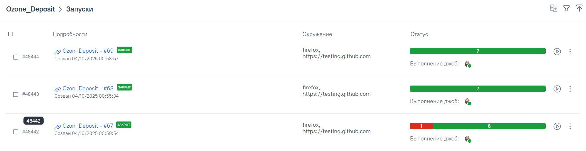
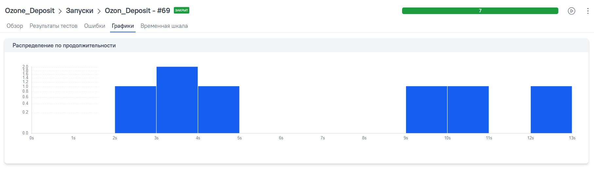

# Ozon Deposit — демо‑проект по автоматизации (Web)

<p align="center">

</p>

## Содержание
> ➠ [Технологический стек](#технологический-стек)  
> ➠ [Покрытый функционал](#покрытый-функционал)  
> ➠ [Сборка в Jenkins](#jenkins)  
> ➠ [Запуск из терминала](#запуск-из-терминала)  
> ➠ [Allure Report](#allure-report)  
> ➠ [Allure TestOps](#allure-testops)  
> ➠ [Уведомления в Telegram](#уведомления-в-telegram)  
> ➠ [Пример видео прохождения тестов](#пример-видео-прохождения-тестов)

## Технологический стек
<p align="center">


</p>

В проекте автотесты написаны на <code>Python + Pytest</code> с использованием <code>Selenium/Selene</code> для UI. 
Сборки запускаются в <code>Jenkins</code>, отчётность — <code>Allure Report</code> и <code>Allure TestOps</code>, уведомления идут в <code>Telegram</code>.

## Покрытый функционал
> UI‑тесты формы вклада <strong>Ozon Deposit</strong>

- [x] Валидный депозит — корректное заполнение формы
- [x] Минимальная сумма — ровно порог
- [x] Сумма ниже минимума — валидационная ошибка
- [x] Ввод нечисловых символов
- [x] Смена срока на 3 месяца — обновление бейджа
- [x] Отображение формы (smoke)
- [x] Капитализация — переключатель влияет на расчёт прибыли

## Jenkins
<p align="center">

</p>

### Параметризованный запуск (пример)
В Jenkins выбирается <code>Build with Parameters</code>: окружение, браузер, версия. После прогона ссылка на Allure доступна из сборки.

## Запуск из терминала
Локально:
```bash
python -m venv .venv && source .venv/bin/activate   # Windows: .venv\Scripts\activate
pip install -r requirements.txt
pytest -m "ui" -q
```

Генерация отчёта локально:
```bash
allure serve allure-results
```

## Allure Report
### Основной отчёт
<p align="center">

</p>

### Графики
<p align="center">

</p>

## Allure TestOps
### Список кейсов
<p align="center">

</p>

### Dashboard
<p align="center">

</p>

## Уведомления в Telegram
<p align="center">

</p>

## Пример видео прохождения тестов
<p align="center">

</p>
