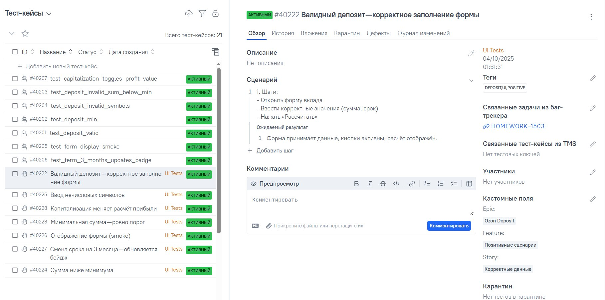
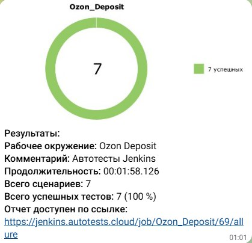
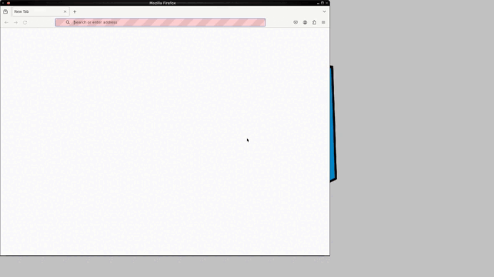

# Ozon Deposit — демо‑проект по автоматизации (Web)
> [Тестируемая страница вклада Ozon](https://finance.ozon.ru/promo/deposit/landing?utm_source=main_page) 
> 
<p align="center">
  
</p>

## Содержание
> ➠ [Технологический стек](#технологический-стек)  
> ➠ [Покрытый функционал](#покрытый-функционал)  
> ➠ [Jenkins](#jenkins)  
> ➠ [Запуск из терминала](#запуск-из-терминала)  
> ➠ [Allure Report](#allure-report)  
> ➠ [Allure TestOps](#allure-testops)  
> ➠ [Уведомления в Telegram](#уведомления-в-telegram)  
> ➠ [Пример видео прохождения тестов](#пример-видео-прохождения-тестов)

## Технологический стек

<p align="center">
  
  
  
  
  
  
  
  
</p>

В проекте автотесты написаны на <code>Python + Pytest</code> с использованием <code>Selenium/Selene</code> для UI. 
Сборки запускаются в <code>Jenkins</code>, отчётность — <code>Allure Report</code> и <code>Allure TestOps</code>, уведомления идут в <code>Telegram</code>.

## Покрытый функционал

> UI‑тесты формы вклада <strong>Ozon Deposit</strong>

- [x] Валидный депозит
- [x] Минимальная сумма
- [x] Сумма ниже минимума 
- [x] Ввод нечисловых символов
- [x] Смена срока вклада
- [x] Отображение формы 
- [x] Капитализация

## Jenkins
> [Перейти к Jenkins-проекту](https://jenkins.autotests.cloud/job/Ozon_Deposit/)  

<p align="center">
  
</p>
<p align="center"><em>Результаты запусков в Jenkins (параметризованные сборки)</em></p>

### Параметризованный запуск (пример)
В Jenkins выбирается <code>Build with Parameters</code>: окружение, браузер, версия. После прогона ссылка на Allure доступна из сборки.

## Запуск из терминала

Локально:
```bash
python -m venv .venv && source .venv/bin/activate   # Windows: .venv\Scripts\activate
pip install -r requirements.txt
pytest -m "ui" -q
```

Генерация отчёта локально:
```bash
allure serve allure-results
```

## Allure Report
> [Пример Allure Report](https://jenkins.autotests.cloud/job/Ozon_Deposit/81/allure/)

<p align="center">
  
</p>
<p align="center"><em>Allure Report: доля успешных тестов</em></p>

## Allure TestOps
> [Перейти к TestOps проекту](https://allure.autotests.cloud/project/4935/test-cases?treeId=0)  
> 
### Список кейсов
<p align="center">
  
</p>

## Уведомления в Telegram

<p align="center">
  
</p>

## Пример видео прохождения тестов

<p align="center">
  
</p>
